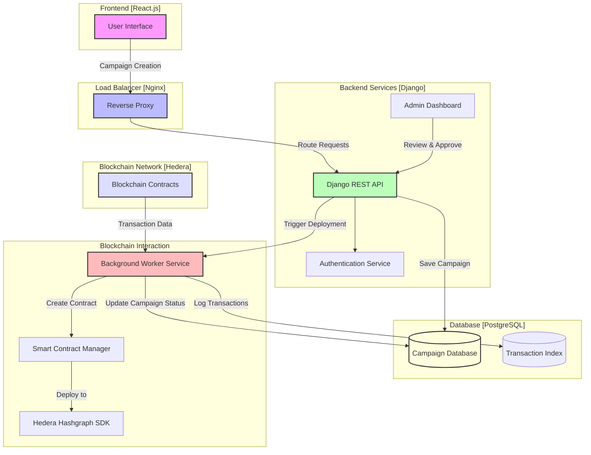

# Hedera Donation Platform

## Live Website
[https://hedera-donation.kingofshiba.xyz/](https://hedera-donation.kingofshiba.xyz/)

**Note**: Please visit the live platform to explore the full functionality of the Hedera Donation project.

## Project Overview

Hedera Donation is a blockchain-powered donation platform that enables transparent and secure fundraising campaigns using Hedera Hashgraph technology.

## Tech Stack

- **Frontend**: React.js
- **Backend**: Django (Python)
- **Blockchain Development**: Hardhat, Solidity
- **Database**: PostgreSQL
- **Containerization**: Docker
- **Additional Technologies**: 
  - Hashgraph SDK
  - JavaScript
  - Nginx (Reverse Proxy)

## System Architecture

### Key Components

1. **Campaign Management**
   - Users can create donation campaigns
   - Admin review and approval process
   - Blockchain-backed campaign tracking

2. **Backend Workflow**
   - Django REST API for campaign management
   - Worker service for campaign monitoring
   - Automated smart contract execution
   - Transaction crawling and tracking

### System Flow

## Key Features

- Transparent donation tracking
- Blockchain-secured transactions
- Admin-controlled campaign approval
- Automated campaign management
- Comprehensive transaction indexing

## Security Considerations
- Implement robust access controls
- Use environment-specific configuration
- Secure blockchain transaction signing
- Regular security audits

## Deployment
- Use Nginx as a reverse proxy
- Configure HTTPS
- Implement rate limiting
- Set up monitoring and logging

## Future Roadmap
- Multi-chain support
- Advanced analytics dashboard
- Improved user verification
- Donation tracking and impact reporting